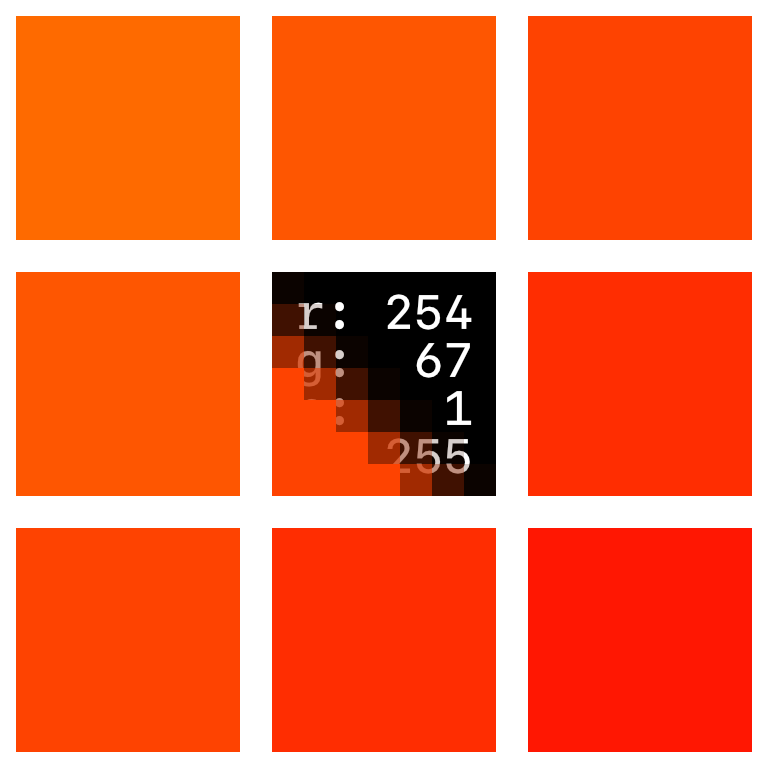

<p align="center">
	<br><br>
	<a href="https://swift.org/package-manager/">
		
	</a>
	<a href="./LICENSE">
		
	</a>
</p>

# Bitmap

###### Easy low-overhead access to individual pixels.

Bitmap uses low-level data pointers to reduce overhead in working with `CGImage`.

It allows you to get and set pixels directly through a 2-argument subscript, as well as offering various bulk creation/modification operations.

### Example

Identify pixels that are neither fully opaque nor fully transparent and turn them red, clearing the rest.

```Swift
for y in 0..<bitmap.height {
	for x in 0..<bitmap.width {
		if case 1...254 = bitmap[x, y].alpha {
			bitmap[x, y] = .red
		} else {
			bitmap[x, y] = .clear
		}
	}
}
```

<table>
  <tr align="center">
    <td>turns this</td>
    <td>into this</td>
  </tr>
  <tr>
    <td></td>
    <td></td>
  </tr>
</table>


